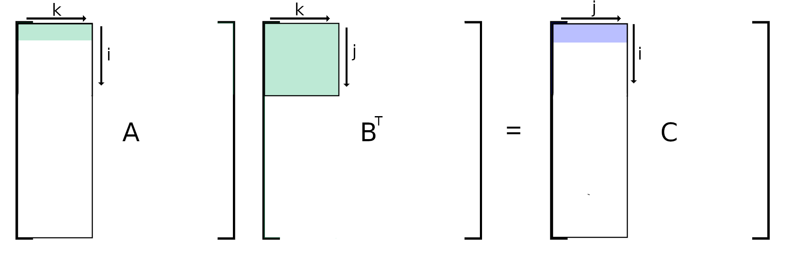
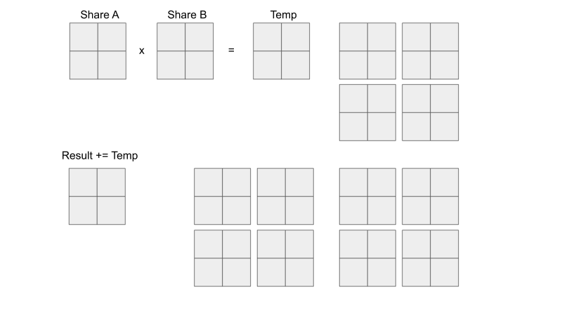

# AA - dotprod
* José Ferreira - a83683
* João Teixeira - a85504

# Development
* code and benchmark matrix multiplication
* A x B = C

## Matrix accesses
| type      | A      | B     |  C     |
|:----------|:------:|:-----:|:------:|
| ijk       | line   | column| line   |
| ijk trans | line   | line  | line   |
| ikj       | line   | line  | line   |
| jki       | column | column| column |
| jki trans | line   | line  | line   |

## Block Optimization

* nested for loops ijk
* transpose B

## Cuda

# Performance Measurement
* PAPI
* sys/time.h

## Data Size
|            | L1 data | L2 data | L3 data  | RAM       |
|:-----------|:-------:|:-------:|:--------:|:---------:|
| cache size |  32768  | 262144  | 31457280 | >31457280 |
| max size   |  52     | 147     | 1619     | >1619     |
| used size  |  40     | 120     | 1500     | 4000      |

Formula: N²\*3\*4 = size

## execution time - sequential
| type      | L1 data | L2 data | L3 data | RAM       |
|:----------|:-------:|:-------:|:-------:|:---------:|
| ijk       | 66      | 1733    | 4239493 | 177553349 |
| ijk trans | 94      | 1698    | 3223331 | 71675215  |
| ikj       | 71      | 1718    | 3194044 | 61695968  |
| jki       | 72      | 1744    | 8596300 | 324751067 |
| jki trans | 69      | 1375    | 2273077 | 45375529  |
time in μs

### RAM accesses (%)
| type      | L1 data | L2 data | L3 data | RAM     |
|:----------|:-------:|:-------:|:-------:|:-------:|
| ijk       | .001321 | .000057 | .000582 | .781009 |
| ijk trans | .001911 | .000105 | .000308 | .084568 |
| ikj       | .027150 | .007252 | .000259 | .030864 |
| jki       | .036501 | .008403 | .001570 | .785903 |
| jki trans | .034159 | .008555 | .000902 | .053824 |

Formula: 100\*L3 misses / Total instructions

## execution time - Block
| type                 | L1 data | L2 data | L3 data | RAM      |
|:---------------------|:-------:|:-------:|:-------:|:--------:|
| block                | -       | -       | -       | 64385275 |
| block + vec          | 71      | 1523    | -       | -        |
| block + vec + OpenMP | -       | -       | -       | 2407551  |

time in μs

## execution time - GPU
| type | L2 data (120) | RAM (512) |
|:-----|:-------------:|:---------:|
| CUDA | 704           |           |
time in μs

* L2 cache is 1.2MiB on kepler k20

# global% miss rate

## global% miss rate L1

| type      | L1 data | L2 data | L3 data | RAM     |
|:----------|:-------:|:-------:|:-------:|:-------:|
| ijk       | .2360   | 2.1902  | 35.5386 | 34.4700 |
| ijk trans | .1865   | 2.0801  | 2.0981  | 2.1194  |
| jki       | .1411   | 1.9620  | 50.0075 | 50.1961 |
| jki trans | .6037   | 7.9182  | 8.4272  | 8.5532  |

Formula: 100\*L1 misses / (Load Ins + Store Ins)

## global% miss rate L2

| type      | L1 data | L2 data | L3 data | RAM     |
|:----------|:-------:|:-------:|:-------:|:-------:|
| ijk       | .0762   | .0237   | 2.3420  | 34.4019 |
| ijk trans | .0902   | .0294   | .0532   | .7009   |
| jki       | .0873   | .0273   | 9.6299  | 50.1126 |
| jki trans | .3874   | .1204   | .2507   | 6.4841  |

Formula: 100\*L2 misses / (Load Ins + Store Ins)

## global% miss rate L3

| type      | L1 data | L2 data | L3 data | RAM    |
|:----------|:-------:|:-------:|:-------:|:------:|
| ijk       | .0025   | .0001   | .0016   | 2.0842 |
| ijk trans | .0664   | .0196   | .0015   | .2712  |
| jki       | .0709   | .0173   | .0031   | 1.5741 |
| jki trans | .3270   | .0831   | .0087   | 2.9880 |

Formula: 100\*L3 misses / (Load Ins + Store Ins)
