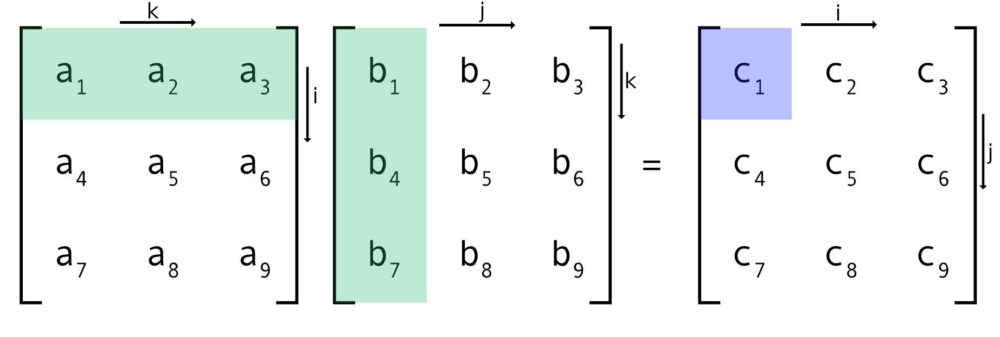

# AA - dotprod
* Jose Ferreira - a83683
* Joao Teixeira - a85504

# Development
* code and benchmark matrix multiplication
* A x B = C

## Matrix accesses
| type      | A      | B     |  C     |
|:----------|:------:|:-----:|:------:|
| ijk       | line   | line  | column |
| ijk trans | line   | line  | line   |
| ikj       | line   | line  | line   |
| jki       | column | column| column |
| jki trans | line   | line  | line   |

## Block Optimization

## Cuda

# Performance Measurement

## Data Size
|            | L1 data | L2 data | L3 data  | RAM       |
|:-----------|:-------:|:-------:|:--------:|:---------:|
| cache size |  32768  | 262144  | 31457280 | >31457280 |
| max size   |  52     | 147     | 1619     | >1619     |
| used size  |  40     | 120     | 1500     | 4000      |

Formula: N²\*3\*4 = size

## execution time - sequential
| type      | L1 data | L2 data | L3 data | RAM       |
|:----------|:-------:|:-------:|:-------:|:---------:|
| ijk       | 66      | 1733    | 4239493 | 177553349 |
| ijk trans |         |         |         |           |
| ikj       | 71      | 1718    | 3194044 | 61695968  |
| jki       | 72      | 1744    | 8596300 | 324751067 |
| jki trans | 69      | 1375    | 2273077 | 45375529  |
time in μs

### RAM accesses
| type      | L1 data | L2 data | L3 data | RAM     |
|:----------|:-------:|:-------:|:-------:|:-------:|
| ijk       | .001321 | .000057 | .000582 | .781009 |
| ijk trans |         |         |         |         |
| ikj       | .027150 | .007252 | .000259 | .030864 |
| jki       | .036501 | .008403 | .001570 | .785903 |
| jki trans | .034159 | .008555 | .000902 | .053824 |

Formula: 100\*L3 misses / Total instructions

## execution time - Block
| type                 | L1 data | L2 data | L3 data | RAM      |
|:---------------------|:-------:|:-------:|:-------:|:--------:|
| block                | -       | -       | -       | 64385275 |
| block + vec          |         |         | -       | -        |
| block + vec + OpenMP | -       | -       | -       | 2407551  |
time in μs

## execution time - GPU
| type | L1 data | L2 data | L3 data | RAM |
|:-----|:-------:|:-------:|:-------:|:---:|
| CUDA | -       | -       | -       |     |
time in μs

# roofline graph

# global% miss rate

## global% miss rate L1

| type      | L1 data | L2 data | L3 data | RAM |
|:----------|:-------:|:-------:|:-------:|:---:|
| ijk       |         |         |         |     |
| ijk trans |         |         |         |     |
| jki       |         |         |         |     |
| jki trans |         |         |         |     |

Formula: 100\*L1 misses / Total accesses

## global% miss rate L2

| type      | L1 data | L2 data | L3 data | RAM |
|:----------|:-------:|:-------:|:-------:|:---:|
| ijk       |         |         |         |     |
| ijk trans |         |         |         |     |
| jki       |         |         |         |     |
| jki trans |         |         |         |     |

Formula: 100\*L2 misses / Total accesses

## global% miss rate L3

| type      | L1 data | L2 data | L3 data | RAM |
|:----------|:-------:|:-------:|:-------:|:---:|
| ijk       |         |         |         |     |
| ijk trans |         |         |         |     |
| jki       |         |         |         |     |
| jki trans |         |         |         |     |

Formula: 100\*L3 misses / Total accesses
